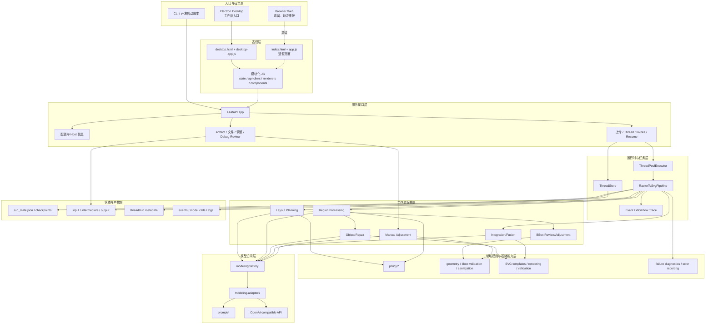
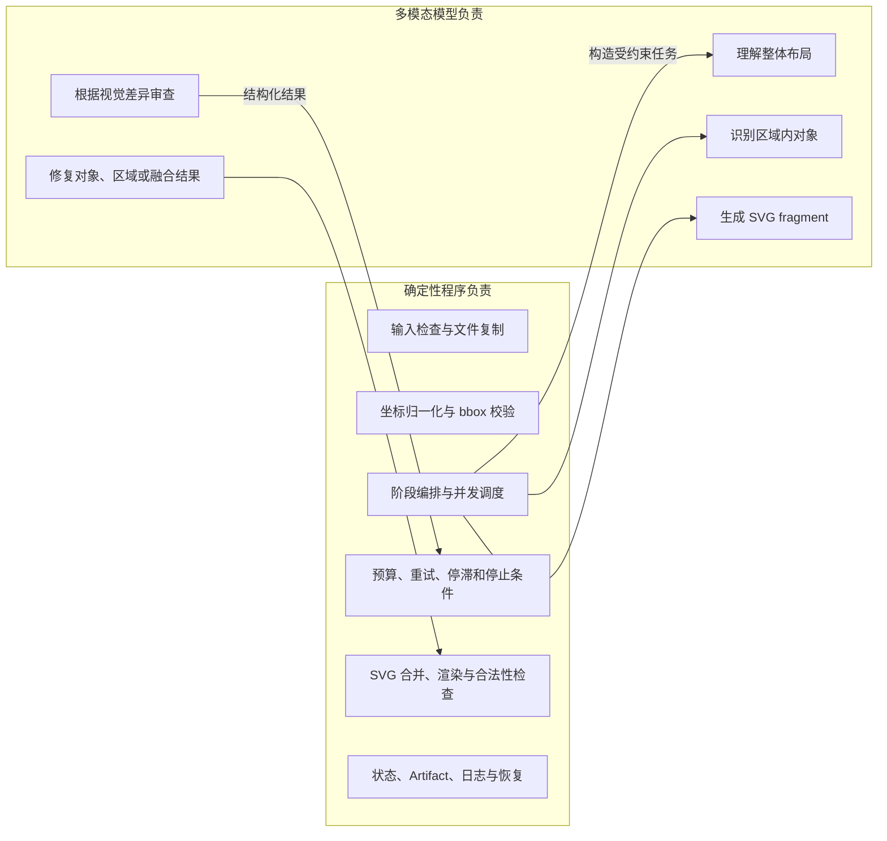

# 系统分层架构

## 1. 分层总图

## 2. 各层职责与边界

### 2.1 入口与宿主层

- Electron 是当前需要重点维护的产品入口。
- Electron 负责选择空闲端口、启动打包后端、等待 `/health`、创建窗口和关闭后端。
- CLI 和启动脚本用于开发、诊断及源代码部署。
- 浏览器 Web 入口虽然仍可由 FastAPI 根路径提供，但已缺乏维护和更新，可能出现错误；它只应作为遗留/诊断入口记录。

### 2.2 表现层

桌面页面通过 JavaScript 模块完成：

- 创建 Thread；
- 获取默认配置和 Runtime Overrides；
- 上传图片并启动 Run；
- 轮询 Snapshot 和 Artifact；
- 展示执行 Trace、区域/对象 bbox、SVG/PNG 预览；
- 发起恢复、人工调整和 Debug Review；
- 下载、重命名或删除历史 Run。

表现层不直接执行图像转换，也不直接访问模型服务。

### 2.3 服务接口层

FastAPI 是所有交互入口的统一边界，主要接口组包括：

| 接口组 | 作用 |
| --- | --- |
| `/health` | 后端存活检查，Electron 启动时使用。 |
| `/config/*` | 默认值、Runtime Overrides 的读取、写入和重置。 |
| `/frontend/host-info` | 告知前端当前宿主模式和服务地址。 |
| `/uploads` | 将 base64 图片写入 Artifact 上传目录。 |
| `/threads` | 创建和读取会话。 |
| `/invoke` | 创建后台转换 Run。 |
| `/resume` | Legacy Agent 审批恢复接口。 |
| `/runs/resume` | 根据持久化 Run State 恢复转换管线。 |
| `/threads/{id}/snapshot` | 获取运行状态、消息和事件。 |
| `/threads/{id}/artifacts` | 获取预览、文件、Trace 和恢复信息。 |
| `/threads/{id}/manual-adjust` | 对完成后的 SVG 进行人工目标驱动调整。 |
| `/threads/{id}/debug-review` | 显式运行区域、对象或融合审查。 |

### 2.4 运行时与任务层

- `ThreadStore` 保存当前进程内的 Thread、Run、消息、事件和审批状态。
- FastAPI 的线程池将耗时转换从 HTTP 请求线程中移出。
- `RasterToSvgPipeline` 是直接多模态转换主路径。
- Pipeline 在运行时同步更新 Thread 事件，并将关键状态写入 Artifact 目录。
- API 侧维护 Active Run 集合，防止运行中的产物被删除。

### 2.5 工作流编排层

`WorkflowAgentSuite` 组合以下主管能力：

- Layout Planning Supervisor；
- BBox Adjustment Supervisor；
- Region Supervisor；
- Object Repair Supervisor；
- Fusion Supervisor。

这里的“Agent”主要表示带明确输入输出合同的模型工作单元，而不是让模型自由决定整个程序控制流。程序仍掌握循环、预算、并发和停止条件。

### 2.6 领域与策略层

领域层将模型输出约束为可执行决策，包括：

- bbox 合法性、越界、坐标空间和清洗；
- Region/Object/Fusion review 的接受、修复或失败规则；
- SVG 模板、fragment 合并、渲染和合法性检查；
- 停滞检测、重试耗尽和失败分类；
- 人工选择区域/对象后的编辑范围计算。

### 2.7 模型访问层

模型访问层负责：

- 解析 provider、base URL、API format 和模型名称；
- 将图片、SVG 文件和结构化上下文装配为模型请求；
- 要求模型返回 Pydantic 对应的结构化结果；
- 记录模型请求、响应、原始文本和 warning；
- 实施模型调用预算。

### 2.8 状态与产物层

文件系统既是用户结果存储，也是调试和恢复基础。完成阶段的中间文件可在恢复时直接读取，避免重复模型调用。

## 3. 确定性程序与模型的责任边界

边界重点：模型给出候选结果与审查意见，是否继续循环、是否耗尽预算、文件写到哪里以及怎样恢复，由程序决定。
