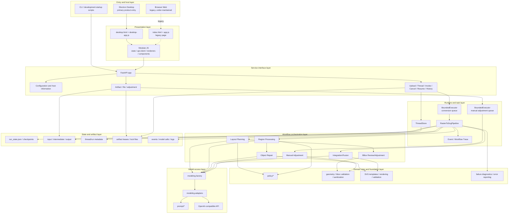
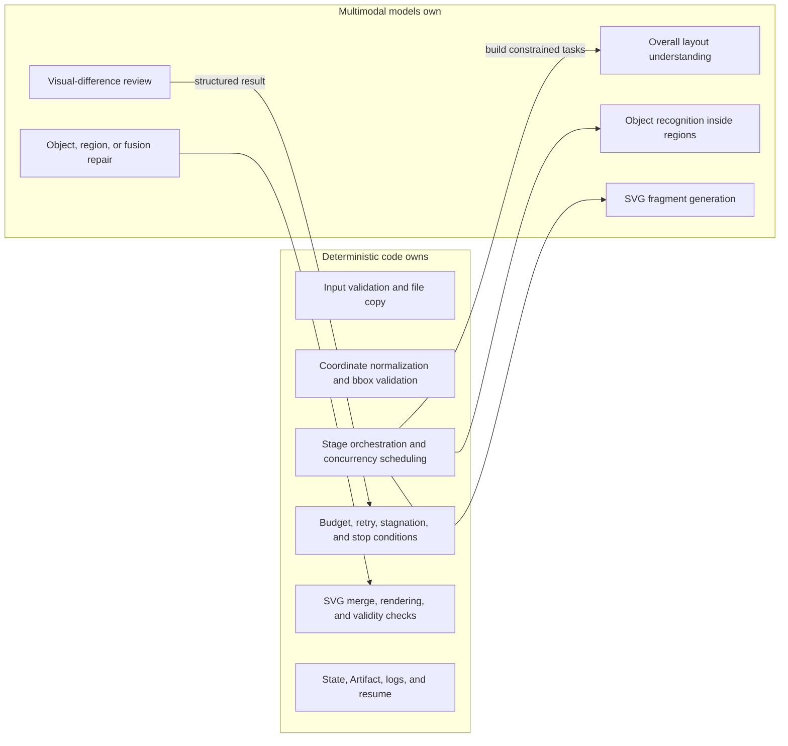

# Layered System Architecture

## 1. Layer Diagram

## 2. Layer Responsibilities and Boundaries

### 2.1 Entry and Host Layer

- Electron is the product entry point that should receive primary maintenance.
- Electron selects a free local port, starts the packaged backend, waits for `/health`, creates the application window, and shuts down the backend.
- CLI and startup scripts are for development, diagnostics, and source deployment.
- The browser Web entry can still be served by the FastAPI root route, but it is under-maintained and may be broken. Treat it as a legacy/diagnostic entry only.

### 2.2 Presentation Layer

The desktop page uses JavaScript modules to:

- create a Thread;
- read default configuration and Runtime Overrides;
- upload an image and start a Run;
- poll Snapshot and Artifact state;
- display Workflow Trace, region/object bbox overlays, SVG/PNG previews;
- start resume and manual adjustment flows;
- download, rename, or delete historical Runs.

The presentation layer does not perform image conversion and does not call model services directly.

### 2.3 Service Interface Layer

FastAPI is the unified boundary for all interactive entry points. Major API groups are:

| API group | Purpose |
| --- | --- |
| `/health` | Backend liveness check used during Electron startup. |
| `/config/*` | Read, write, and reset defaults and Runtime Overrides. |
| `/frontend/host-info` | Tell the frontend the current host mode and service URL. |
| `/uploads` | Persist base64 image uploads into the artifact upload area. |
| `/threads` | Create and read session containers. |
| `/invoke` | Create a background conversion Run. |
| `/runs` | Page, search, open, and preview historical projects. |
| `/threads/{id}/runs/{run_id}/cancel` | Request cancellation for a queued or running Run. |
| `/resume` | Legacy approval-resume endpoint; currently returns 410. |
| `/runs/resume` | Resume the conversion pipeline from persisted Run State. |
| `/threads/{id}/snapshot` | Read runtime status, messages, and events. |
| `/threads/{id}/artifacts` | Read previews, files, Workflow Trace, and resume information. |
| `/threads/{id}/manual-adjust` | Apply user-targeted post-processing to a completed SVG. |

FastAPI currently rejects non-loopback clients through a local-only middleware. Installed builds and development scripts should be understood as "local UI calling local backend", not as a LAN service.

### 2.4 Runtime and Task Layer

- `ThreadStore` keeps the process-local view of Threads, Runs, messages, events, and approval state.
- FastAPI uses `BoundedExecutor` to move long conversions out of the HTTP request thread and cap the top-level conversion queue.
- Manual adjustment uses a separate `BoundedExecutor` so post-processing does not share the conversion queue.
- Effective runtime settings are frozen when a Run is accepted, so later Runtime Override changes do not affect queued Runs.
- The API registers a cancellation event for queued/running Runs. A queued task may be cancelled before execution; a running Pipeline stops cooperatively when it checks the event.
- `RasterToSvgPipeline` is the direct multimodal conversion main path.
- The Pipeline updates Thread events during execution and writes key state into the Artifact directory.
- The API keeps an Active Run set and Artifact leases to prevent conversion, resume, rename, delete, or manual adjustment from mutating the same artifact directory concurrently.

### 2.5 Workflow Orchestration Layer

`WorkflowAgentSuite` combines these supervisor capabilities:

- Layout Planning Supervisor;
- BBox Adjustment Supervisor;
- Region Supervisor;
- Object Repair Supervisor;
- Fusion Supervisor.

Here "Agent" means a model work unit with explicit input/output contracts. It does not mean the model freely controls the whole program flow. Code still owns loops, budgets, concurrency, and stop conditions.

### 2.6 Domain and Policy Layer

The domain layer constrains model output into executable decisions:

- bbox validity, overflow handling, coordinate spaces, and sanitization;
- accept, repair, and failure rules for Region/Object/Fusion review;
- SVG templates, fragment merging, rendering, and validity checks;
- stagnation detection, retry exhaustion, and failure classification;
- edit-scope calculation after manual region/object selection.

### 2.7 Model Access Layer

The model access layer:

- resolves provider, base URL, API format, and model names;
- packages images, SVG files, and structured context into model requests;
- asks models to return Pydantic-compatible structured results;
- records model requests, responses, raw text, and warnings;
- enforces model-call budgets.

### 2.8 State and Artifact Layer

The filesystem is both user-result storage and the foundation for debugging, History, and resume. Completed intermediates can be read directly during resume to avoid repeated model calls. History lists and previews are derived from persisted Artifact metadata and existing input/output files.

## 3. Deterministic Code vs. Model Responsibility

The important boundary is that models propose candidate outputs and review judgments. Code decides whether to continue a loop, whether retry capacity remains, where files are written, and how resume proceeds.
