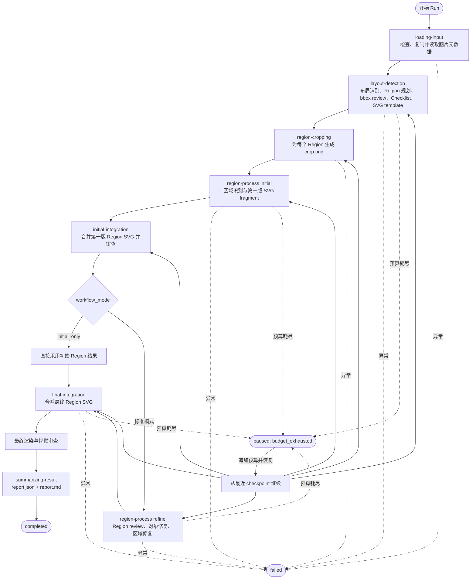
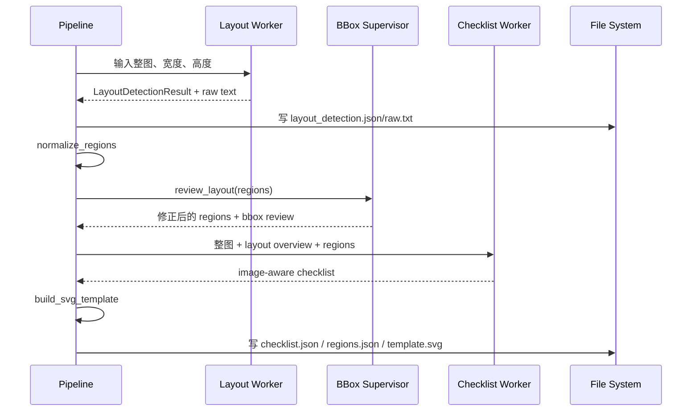
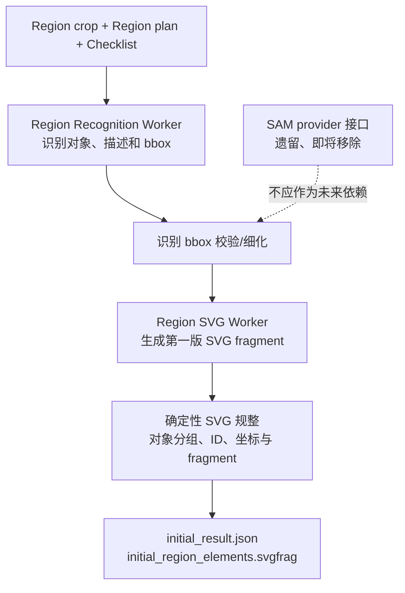
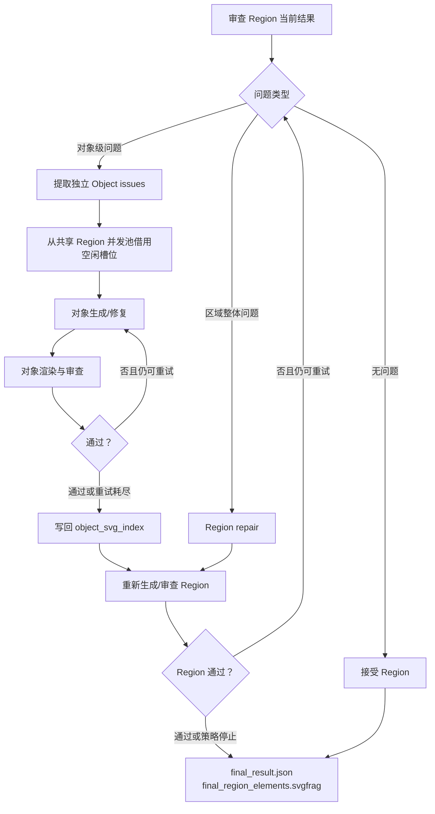
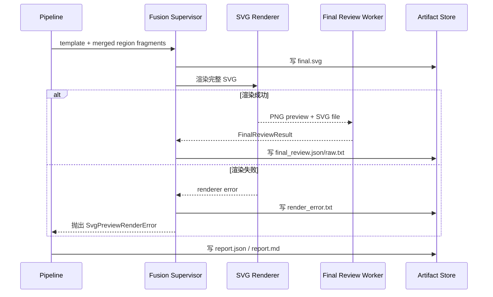
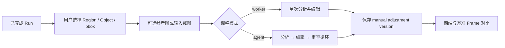

# 核心转换工作流

## 1. 主流程

以下流程直接对应 `RasterToSvgPipeline.run()` 的现行阶段。

## 2. Layout Planning 阶段

该阶段的输出合同是：

- 画布尺寸和整体描述；
- 归一化、非重叠且可裁剪的 Region 列表；
- 后续生成和审查使用的 Checklist；
- 用于融合各 Region fragment 的 SVG 模板。

注意：bbox review 是 Layout Supervisor 的内部步骤，不是主 `run()` 中独立的顶层阶段。

## 3. Region 初始生成

每个 Region 都会建立独立工作目录，并在串行或并行模式下处理。

SAM 相关接口在代码中尚存，但架构决策应按“待移除”处理；文档、测试和新功能不应扩大其依赖范围。

## 4. Initial Integration 的作用

第一轮 Region 生成完成后，系统不会立即逐区域修复，而是先合并为完整画布：

1. 将每个 Region 的初始 fragment 注入 SVG template；
2. 渲染完整 SVG 为可供模型比较的预览；
3. 执行全图审查；
4. 为后续 Region refinement 提供全局视觉上下文。

这避免了只看局部 crop 时无法发现的比例、对齐、跨区域一致性和整体风格问题。

## 5. Region Refinement 与 Object Repair

### 并发策略

- Region 可以通过 `region_processing_mode=parallel` 并行处理。
- 最大 Region Worker 数由 `region_concurrency` 限制。
- 对象修复优先在当前线程处理第一个对象，再借用 Region 阶段剩余并发槽位处理其他独立对象。
- 输出会按原始 Region 顺序重新组装，避免并发完成顺序影响融合顺序。

### 重试策略

- Region 和 Object 使用独立的 retry task key。
- 每次循环先检查是否仍有 retry capacity。
- 重试耗尽后保留最后一个可用 SVG，而不是无限循环。
- Review、Policy 和停滞条件共同决定是否继续。

## 6. Fusion 与最终输出

最终有效性不仅取决于 XML/SVG 是否可解析，还会综合最终 Review 是否仍有未解决问题。

## 7. 人工调整后处理

人工调整不是核心自动转换管线中的阶段，而是完成 Run 后的独立后处理：

人工调整生成新版本，不应静默覆盖自动转换的原始最终结果。

