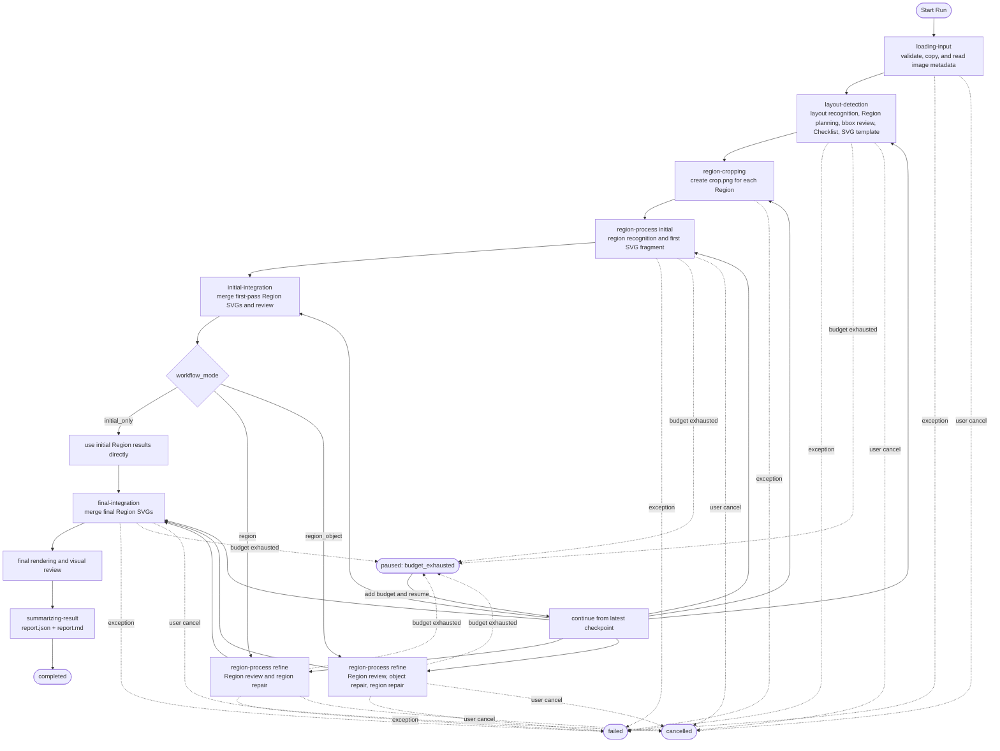
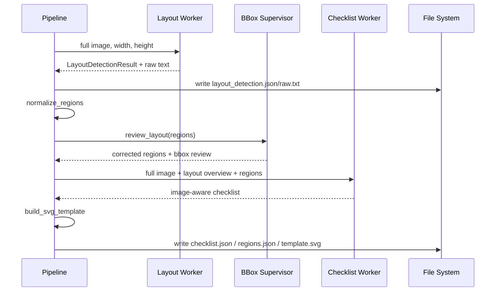
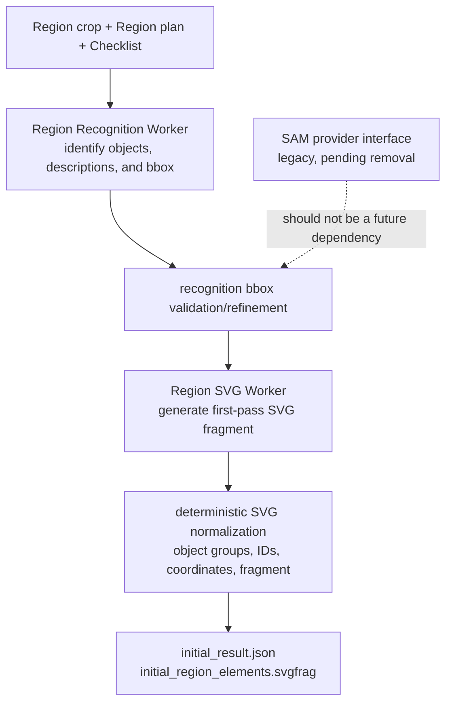
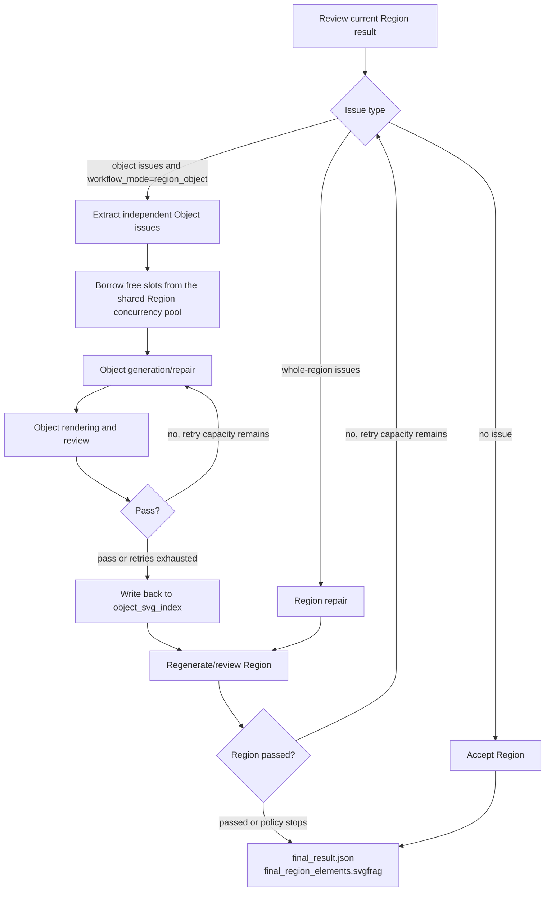
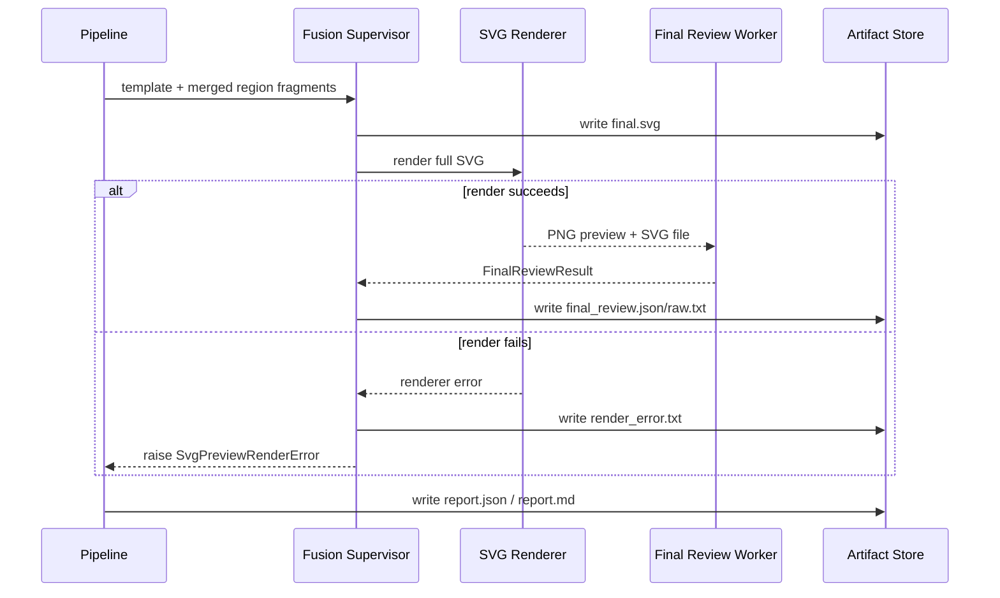
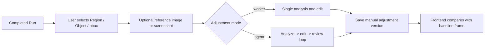

# Core Conversion Workflow

## 1. Main Flow

The following flow maps directly to the current stages in `RasterToSvgPipeline.run()`.

`workflow_mode` currently has three values: `initial_only` skips refinement; `region` runs only region-level review and region repair; `region_object` is the default main path and enables object-level repair in addition to region-level repair. Object repair does not run in every refinement mode.

## 2. Layout Planning Stage

The output contract of this stage is:

- canvas dimensions and overall description;
- normalized, non-overlapping, croppable Region list;
- Checklist used by downstream generation and review;
- SVG template used to fuse Region fragments.

Note: bbox review is an internal step of the Layout Supervisor, not a separate top-level stage in `run()`.

## 3. Initial Region Generation

Each Region gets an independent working directory and can be processed serially or in parallel.

SAM-related interfaces still exist in code, but architecture decisions should treat them as pending removal. Documentation, tests, and new features should not expand their dependency surface.

## 4. Purpose of Initial Integration

After first-pass Region generation, the system does not immediately repair each region. It first merges the regions into a full canvas:

1. inject each Region's initial fragment into the SVG template;
2. render the complete SVG as a preview for model comparison;
3. run full-image review;
4. provide global visual context for later Region refinement.

This catches proportion, alignment, cross-region consistency, and overall style issues that cannot be reliably seen from local crops alone.

## 5. Region Refinement and Object Repair

### Concurrency Strategy

- Regions can run in parallel with `region_processing_mode=parallel`.
- The maximum number of Region workers is capped by `region_concurrency`.
- Object repair processes the first object on the current thread, then borrows remaining Region-stage slots for other independent objects.
- Top-level conversion Runs are also capped by the API `BoundedExecutor`, so capacity planning must consider the Run queue, Region concurrency, and borrowed object-repair slots together.
- Results are reassembled in original Region order, so parallel completion order does not change fusion order.

### Retry Strategy

- Region and Object work use independent retry task keys.
- Each loop checks whether retry capacity remains before attempting more work.
- When retries are exhausted, the last usable SVG is retained rather than looping forever.
- Review, policy rules, and stagnation conditions jointly decide whether to continue.

## 6. Fusion and Final Output

Final validity is not only XML/SVG parseability. It also incorporates whether the final Review still reports unresolved issues.

## 7. Manual Adjustment Post-Processing

Manual adjustment is not a stage of the automatic conversion pipeline. It is an independent post-processing flow after a Run completes.

Manual adjustment creates a new version. It should not silently overwrite the original final result from automatic conversion.
