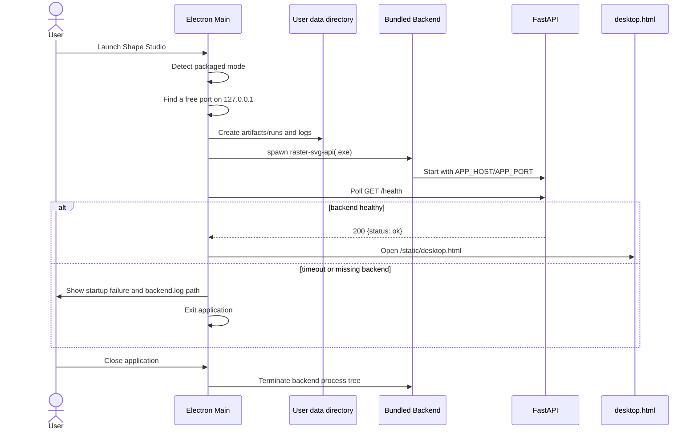
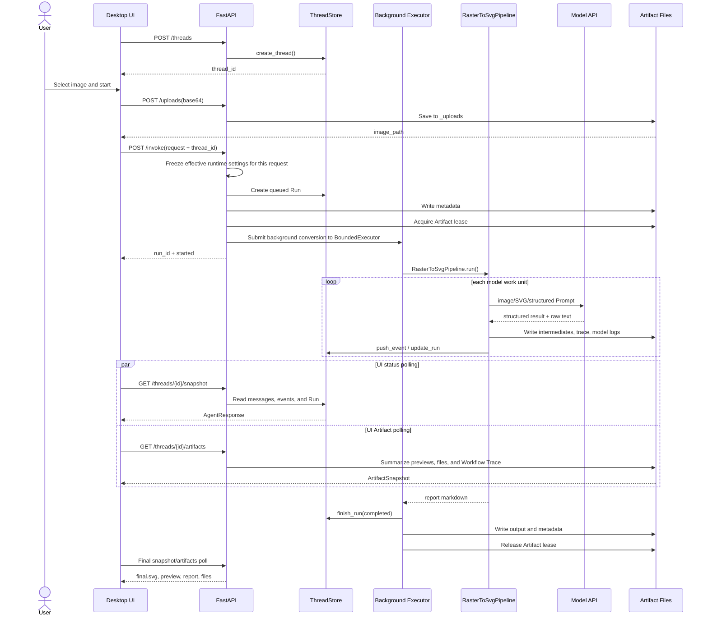
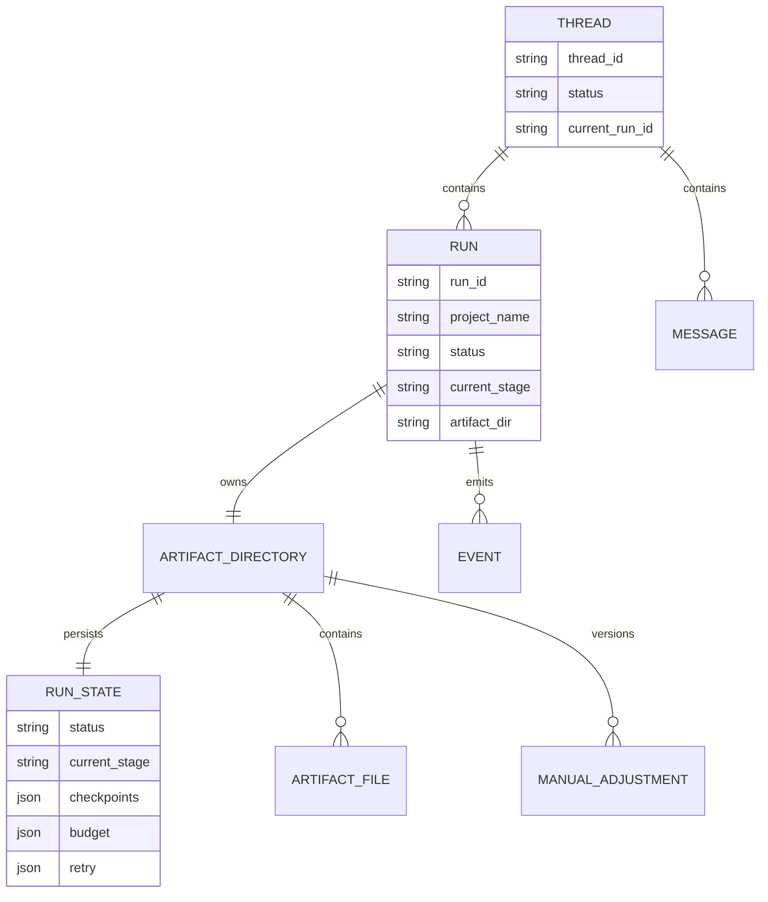

# Runtime, Interfaces, and Interaction Sequences

## 1. Installed Desktop Startup Sequence



## 2. End-to-End Conversion Request Sequence



If the user cancels a queued/running Run, the API sets that Run's cancellation event. A queued future can be cancelled before execution starts. A Run already inside the Pipeline stops cooperatively at stage boundaries and around model calls, then writes `cancelled` status.

## 3. Background Execution Model

HTTP `/invoke` does not wait for full conversion:

1. the API validates the Thread and request;
2. it creates the Run and Artifact directory;
3. it submits `_run_agent_in_background` to `BoundedExecutor`;
4. it immediately returns a Run Start Response to the frontend;
5. the frontend polls for progress.

The conversion executor has a fixed top-level worker count and uses `SHAPE_STUDIO_MAX_QUEUED_RUNS` to cap the wait queue. If the queue is full, the API returns 429. Manual adjustment has its own executor and queue, so long conversions do not block post-processing. Each Pipeline may also create local Region/Object thread pools, so capacity planning must consider:

```text
concurrent Runs x Region concurrency per Run x borrowed object-repair slots x model-side rate limits
```

There is also a service boundary: FastAPI only accepts loopback clients. Installed and development builds should be deployed as "local UI calling local backend", not as an exposed LAN service.

## 4. Thread, Run, and Artifact Relationship



- Thread is the frontend session container and can hold multiple Runs in history.
- Run is one concrete conversion or resume execution.
- Artifact Directory is the persisted source of truth for a Run.
- ThreadStore is mainly a process-local runtime view; after service restart, resume depends on disk Artifacts and Run State.
- The global History page does not depend on the in-memory ThreadStore. It scans persisted Run metadata and can attach a historical Run back to its owning Thread.
- Artifact lease is a process-local registry plus file lock that protects the same Artifact Directory from concurrent conversion, resume, manual adjustment, rename, or delete.

## 5. Main API Contracts

### 5.1 Configuration and Host

| Method | Path | Purpose |
| --- | --- | --- |
| GET | `/config/defaults` | Return frontend defaults. |
| GET | `/config/runtime-overrides` | Read persisted overrides without returning plaintext API Key. |
| POST | `/config/runtime-overrides` | Merge and save override configuration. |
| DELETE | `/config/runtime-overrides` | Clear override configuration. |
| GET | `/frontend/host-info` | Return desktop/web host mode and URL. |
| POST | `/dev/shutdown` | Local development shutdown endpoint; requires the development token and is not a product API. |

### 5.2 Execution and Monitoring

| Method | Path | Purpose |
| --- | --- | --- |
| POST | `/uploads` | Save an input image. |
| POST | `/threads` | Create a Thread. |
| GET | `/runs` | Page global History projects with status filters, search, and sorting. |
| POST | `/runs/{run_id}/open` | Attach a persisted historical Run back to its owning Thread. |
| GET | `/runs/{run_id}/history-preview` | Return read-only input/output preview URLs for History cards. |
| GET | `/runs/{run_id}/preview/{kind}` | Read a historical Run's input or output preview file. |
| GET | `/threads/{thread_id}` | Read raw Thread state. |
| POST | `/invoke` | Create a new background conversion Run. |
| GET | `/threads/{thread_id}/snapshot` | Return a UI-friendly runtime snapshot. |
| GET | `/threads/{thread_id}/artifacts` | Return the Artifact view. |
| GET | `/threads/{thread_id}/artifacts/file` | Preview or download an Artifact file. |
| POST | `/threads/{thread_id}/runs/{run_id}/cancel` | Request cancellation for a queued/running Run. |

### 5.3 Resume and Post-Processing

| Method | Path | Purpose |
| --- | --- | --- |
| GET | `/runs/resume-plan` | Compute resumable stages for a Run owned by the current Thread. |
| POST | `/runs/resume` | Continue conversion in the original Thread after ownership validation. |
| POST | `/resume` | Legacy approval resume; currently returns 410 and points users to `/runs/resume`. |
| POST | `/threads/{thread_id}/manual-adjust` | Create a manual-adjustment version. |
| PATCH | `/threads/{thread_id}/runs/{run_id}` | Rename a project. |
| DELETE | `/threads/{thread_id}/runs/{run_id}` | Delete a non-active Run. |

## 6. Frontend Maintenance Boundary

### Current Maintenance Targets

- `desktop.html`;
- `desktop-app.js`;
- `static/js/api-client.js`;
- `static/js/state.js`;
- `static/js/renderers/*`;
- `static/js/components/*`.

### Legacy Targets

- `index.html` returned by the root path `/`;
- `app.js` and styles tightly coupled to the old Web page.

The browser Web page is under-maintained and may lag behind configuration fields, manual adjustment, History, or Workflow Trace behavior. Fixing desktop functionality should not imply that the old Web page must gain the same capability unless the project explicitly decides to revive that entry.
