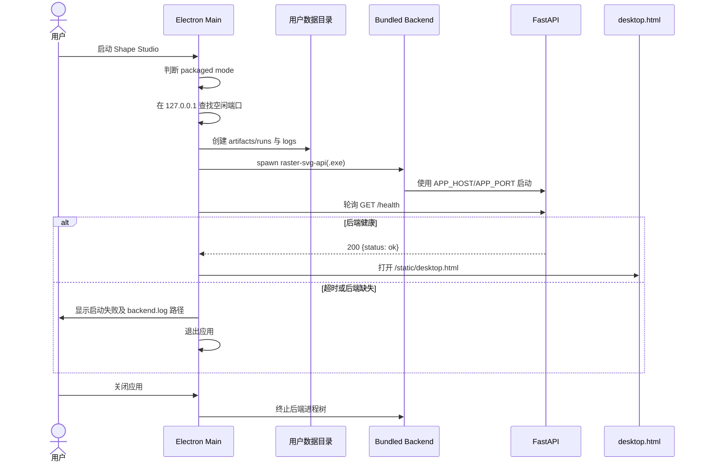
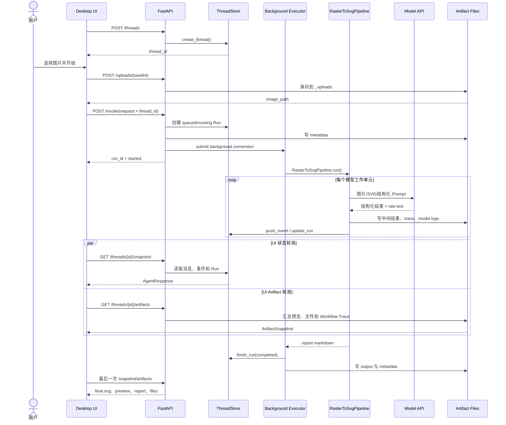
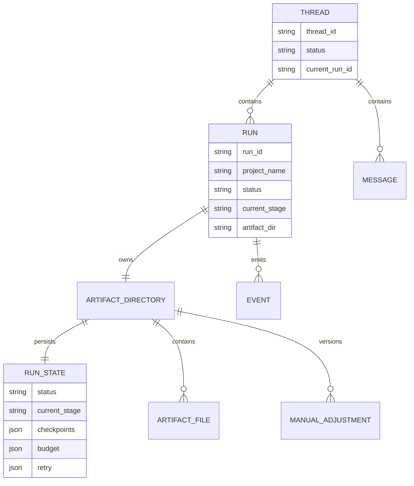

# 运行时、接口与交互时序

## 1. 桌面安装版启动时序



## 2. 一次转换请求的端到端时序



## 3. 后台执行模型

HTTP `/invoke` 不等待完整转换：

1. API 验证 Thread 和请求；
2. 创建 Run 和 Artifact 目录；
3. 将 `_run_agent_in_background` 提交到线程池；
4. 立即向前端返回 Run Start Response；
5. 前端通过轮询读取运行进度。

当前 API 全局线程池为有限 Worker 数，防止单个服务进程无限创建顶层 Run 线程。每个 Pipeline 内部还可能为 Region/Object 创建局部线程池，因此容量规划需要同时考虑：

```text
并发 Run 数 × 每个 Run 的 Region 并发 × 模型端限流
```

## 4. Thread、Run 与 Artifact 的关系



- Thread 是前端会话容器，可以保留多次 Run 历史。
- Run 是一次具体转换或恢复执行。
- Artifact Directory 是 Run 的持久化事实来源。
- ThreadStore 主要是进程内运行视图；服务重启后的恢复依赖磁盘 Artifact 和 Run State。

## 5. 主要接口契约

### 5.1 配置与宿主

| Method | Path | 作用 |
| --- | --- | --- |
| GET | `/config/defaults` | 返回前端默认配置。 |
| GET | `/config/runtime-overrides` | 读取持久化覆盖配置，不回传 API Key 明文。 |
| POST | `/config/runtime-overrides` | 合并并保存覆盖配置。 |
| DELETE | `/config/runtime-overrides` | 清空覆盖配置。 |
| GET | `/frontend/host-info` | 返回 desktop/web host mode 和 URL。 |

### 5.2 执行与监控

| Method | Path | 作用 |
| --- | --- | --- |
| POST | `/uploads` | 保存输入图片。 |
| POST | `/threads` | 创建 Thread。 |
| GET | `/threads/{thread_id}` | 读取 Thread 原始状态。 |
| POST | `/invoke` | 创建新的后台转换 Run。 |
| GET | `/threads/{thread_id}/snapshot` | 获取适合 UI 的运行快照。 |
| GET | `/threads/{thread_id}/artifacts` | 获取 Artifact 视图。 |
| GET | `/threads/{thread_id}/artifacts/file` | 预览或下载 Artifact 文件。 |

### 5.3 恢复与后处理

| Method | Path | 作用 |
| --- | --- | --- |
| GET | `/runs/resume-plan` | 根据当前 Thread 拥有的 Run ID 计算可恢复阶段。 |
| POST | `/runs/resume` | 校验 Run 所有权后在原 Thread 中继续转换。 |
| POST | `/threads/{thread_id}/manual-adjust` | 创建人工调整版本。 |
| POST | `/threads/{thread_id}/debug-review` | 独立执行审查工具。 |
| PATCH | `/threads/{thread_id}/runs/{run_id}` | 重命名项目。 |
| DELETE | `/threads/{thread_id}/runs/{run_id}` | 删除非活动 Run。 |

## 6. 前端维护边界

### 现行维护对象

- `desktop.html`；
- `desktop-app.js`；
- `static/js/api-client.js`；
- `static/js/state.js`；
- `static/js/renderers/*`；
- `static/js/components/*`。

### 遗留对象

- 根路径 `/` 返回的 `index.html`；
- 与旧 Web 页面强绑定的 `app.js` 和样式。

浏览器 Web 页面缺乏持续维护，可能在配置字段、人工调整、历史项目或 Workflow Trace 等功能上落后。修复桌面功能时，不应默认要求旧 Web 页面同步具备完全一致能力，除非项目重新决定恢复该入口。
