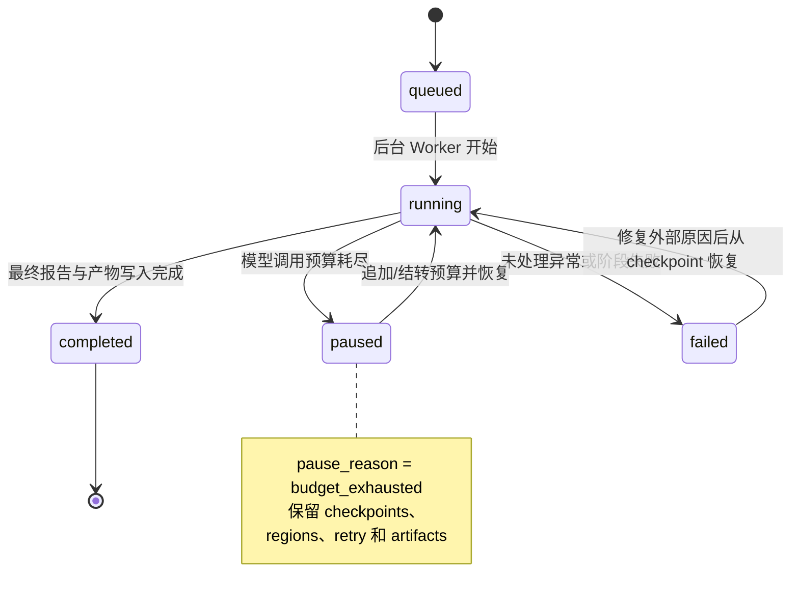
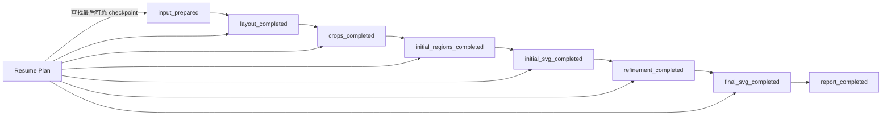
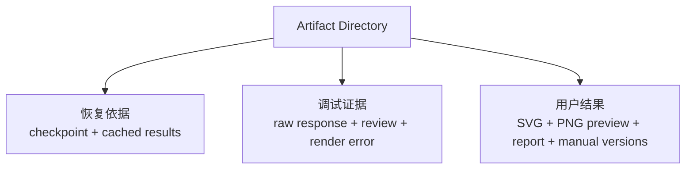
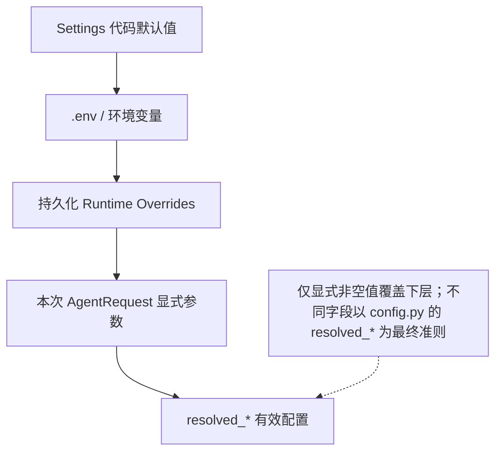

# 状态、Artifact、恢复与配置

## 1. Run 状态机



## 2. Checkpoint 与恢复路线



恢复时的基本规则：

- checkpoint 为真且对应文件存在：复用文件；
- checkpoint 为真但关键文件缺失：应视为状态不一致并进入失败诊断；
- Region 初始或最终结果可逐个复用，未完成 Region 继续处理；
- 恢复不是复制一份旧结果，而是继续同一 Artifact 目录中的状态机；
- `budget_mode` 决定剩余预算结转还是额外补充。

## 3. Run State 内容

| 字段组 | 说明 |
| --- | --- |
| 标识 | `run_id`、`thread_id`、`project_name` |
| 总状态 | `status`、`pause_reason`、`current_stage`、`resume_token` |
| 请求快照 | 原始 `AgentRequest`，用于恢复时重建 Pipeline |
| Budget | limit、used、remaining、carry_forward/top_up |
| Retry | max_retry、各 task counts、exhausted tasks |
| Checkpoints | 各阶段是否完成 |
| Regions | 每个 Region 的状态、阶段、最后完成步骤、目录 |
| Failure | 类型、阶段、root cause、结构化 diagnostic |
| Timestamps | started、updated、paused、finished |

## 4. Artifact 目录逻辑结构

实际文件会随运行阶段和功能开关变化，建议按以下逻辑理解：

```text
<run-dir>/
├─ input/
│  ├─ request.json
│  ├─ input_metadata.json
│  └─ <copied-source-image>
├─ intermediate/
│  ├─ layout_detection.json
│  ├─ layout_detection_raw.txt
│  ├─ requirement_summary.json
│  ├─ checklist.json
│  ├─ regions.json
│  ├─ template.svg
│  ├─ initial.svg
│  ├─ initial_review.json
│  ├─ region_results.json
│  └─ regions/
│     └─ <region-id>/
│        ├─ crop.png
│        ├─ region_plan.json
│        ├─ initial_result.json
│        ├─ final_result.json
│        ├─ region generation/review intermediate files
│        ├─ final_region_elements.svgfrag
│        └─ objects/<object-id>/...
├─ output/
│  ├─ final.svg
│  ├─ final_review.json
│  ├─ final_review_raw.txt
│  ├─ report.json
│  ├─ report.md
│  ├─ review_assets/...
│  └─ manual_adjustments/
│     └─ <adjustment-version>/...
├─ run_state.json
└─ runtime/model/event/metadata logs
```

## 5. Artifact 的三种角色



因此 Artifact 格式变更不是单纯的内部重构，可能同时影响：

- 前端 ArtifactSnapshot；
- Resume Plan；
- 历史项目兼容；
- 人工调整；
- Debug Review；
- 用户下载与项目重命名。

## 6. Workflow Trace

Workflow Trace 是从运行事件和 Artifact 中构造的前端执行树。Node 记录：

- 父子关系；
- stage/region/object/loop/terminal 类型；
- pending、running、success、retrying、blocked、failed 等状态；
- 串行或并行模式；
- Region/Object 目标；
- iteration、route、开始结束时间和耗时；
- 预算、循环次数和失败摘要。

Trace 是可观测性视图，不应被当作唯一恢复状态；恢复以 `run_state.json` 和实际文件为准。

## 7. 配置来源与覆盖关系



概念上的优先级是：

```text
本次请求显式值 > Runtime Overrides > 环境变量/.env > 代码默认值
```

维护时必须以每个 `resolved_*` 实现为准，因为部分字段还包含兼容逻辑或联动规则，例如并发数可能依赖 processing mode。

## 8. 关键配置分组

| 分组 | 主要配置 |
| --- | --- |
| 模型连接 | API Key、Base URL、API Provider、API Format |
| 模型选择 | Agent/Coordinator Model、Subagent/Worker Model |
| 调用行为 | max retries、previous response id、request timeout |
| 工作流 | workflow mode、region processing mode |
| 并发 | region concurrency、bbox issue concurrency |
| 质量循环 | max retry、fusion max retry、stagnation rounds |
| 成本控制 | max budget、resume budget mode |
| 记忆 | supervisor memory enabled/persist enabled |
| 文件与服务 | artifact root、config dir、host、port |
| 待移除遗留项 | SAM enabled/provider/remote URL/fallback 配置 |

## 9. 敏感信息

- Runtime Override API 不应向前端回传 API Key 明文，只返回是否已配置。
- 安装版配置写入用户数据目录，而不是安装目录或项目源码目录。
- Debug 输出和请求日志应避免把完整密钥写入 Artifact。
- 分享 Run 目录前应检查 request/config/model call 日志中是否包含服务地址或其他敏感上下文。
