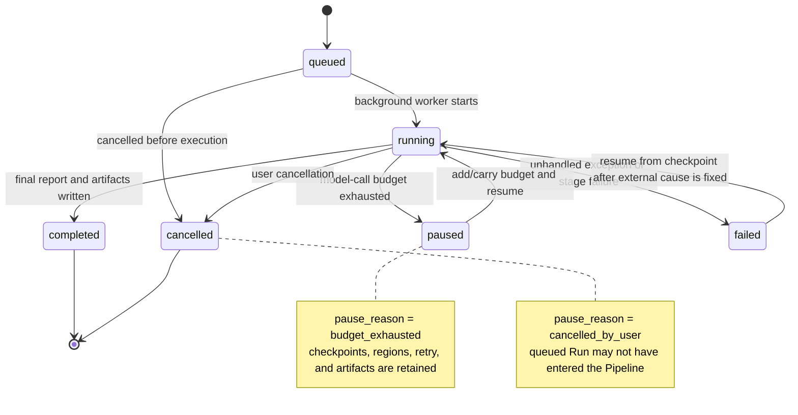
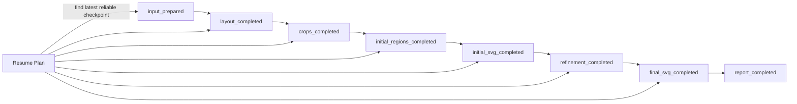
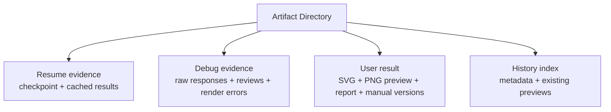
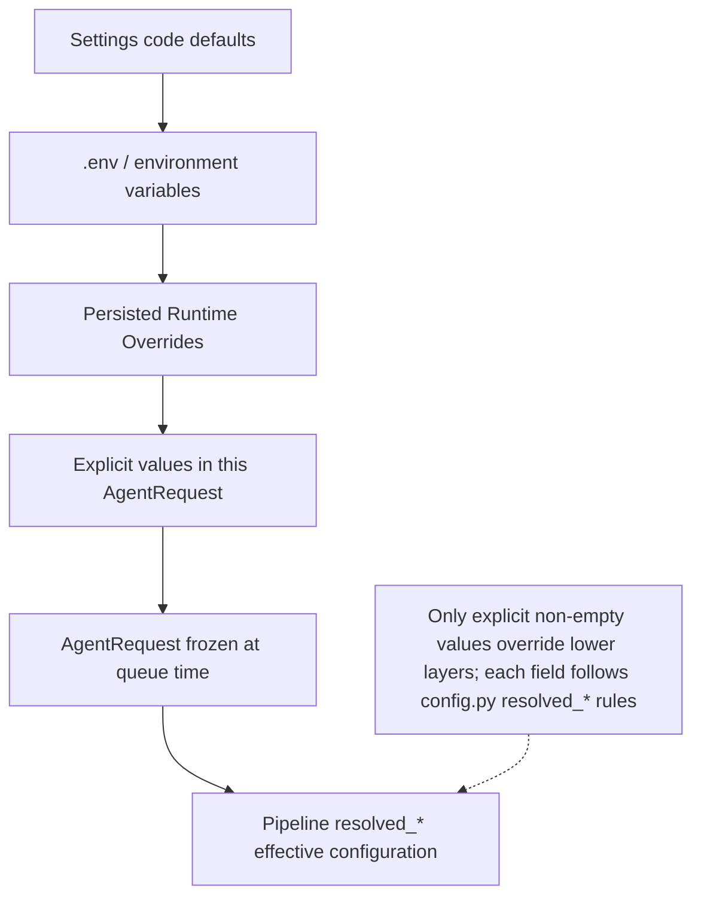

# State, Artifacts, Resume, and Configuration

## 1. Run State Machine



## 2. Checkpoints and Resume Route



Basic resume rules:

- if a checkpoint is true and the corresponding files exist, reuse those files;
- if a checkpoint is true but key files are missing, treat it as inconsistent state and enter failure diagnostics;
- initial or final Region results can be reused per Region, while incomplete Regions continue processing;
- resume does not copy an old result into a new run; it continues the state machine in the same Artifact directory;
- `budget_mode` decides whether remaining budget is carried forward or extra budget is added.

## 3. Run State Content

| Field group | Description |
| --- | --- |
| Identity | `run_id`, `thread_id`, `project_name` |
| Overall state | `status`, `pause_reason`, `current_stage`, `resume_token`; `status` includes `queued`, `running`, `paused`, `completed`, `failed`, `cancelled` |
| Request snapshot | Frozen `AgentRequest` captured at queue time and used to rebuild the Pipeline during resume |
| Budget | limit, used, remaining, carry_forward/top_up |
| Retry | max_retry, per-task counts, exhausted tasks |
| Checkpoints | Whether each stage has completed |
| Regions | Per-Region state, stage, last completed step, and directory |
| Failure | Type, stage, root cause, structured diagnostic |
| Timestamps | started, updated, paused, finished |

## 4. Artifact Directory Logical Structure

Actual files vary by stage and feature flags, but the directory should be understood as:

```text
<run-dir>/
|- input/
|  |- request.json
|  |- input_metadata.json
|  `- <copied-source-image>
|- intermediate/
|  |- layout_detection.json
|  |- layout_detection_raw.txt
|  |- requirement_summary.json
|  |- checklist.json
|  |- regions.json
|  |- template.svg
|  |- initial.svg
|  |- initial_review.json
|  |- region_results.json
|  `- regions/
|     `- <region-id>/
|        |- crop.png
|        |- region_plan.json
|        |- initial_result.json
|        |- final_result.json
|        |- region generation/review intermediate files
|        |- final_region_elements.svgfrag
|        `- objects/<object-id>/...
|- output/
|  |- final.svg
|  |- final_review.json
|  |- final_review_raw.txt
|  |- report.json
|  |- report.md
|  |- review_assets/...
|  `- manual_adjustments/
|     `- <adjustment-version>/...
|- run_state.json
`- runtime/model/event/metadata logs
```

## 5. Four Roles of Artifacts



Artifact format changes are therefore not merely internal refactors. They may affect:

- frontend `ArtifactSnapshot`;
- Resume Plan;
- historical project compatibility;
- manual adjustment;
- user downloads and project renaming.

## 6. Artifact Concurrency Protection

Mutable operations on the same Artifact Directory must first acquire an Artifact lease. The current implementation uses a process-local registry plus adjacent `.shape-studio-locks/*.lock` files. It covers conversion, resume, manual adjustment, rename, and delete operations. If acquisition fails, the API returns a conflict rather than allowing two operations to write to or delete the same Run directory.

The Active Run set quickly blocks deletion of running projects. Artifact leases are the more general directory-level write protection. Both constraints should be preserved when maintaining Artifact read/write logic.

## 7. Workflow Trace

Workflow Trace is the frontend execution tree built from runtime events and Artifacts. Nodes record:

- parent/child relationships;
- stage/region/object/loop/terminal kind;
- pending, running, success, retrying, blocked, failed, and related statuses;
- serial or parallel execution mode;
- Region/Object targets;
- iteration, route, start/end time, and duration;
- budget, loop counts, and failure summaries.

Trace is an observability view. It should not be treated as the only resume state; resume is based on `run_state.json` and actual files.

## 8. Configuration Sources and Override Order



Conceptually, priority is:

```text
explicit values in this request > Runtime Overrides > environment/.env > code defaults
```

Maintenance must follow each `resolved_*` implementation because some fields include compatibility or coupling rules. For example, concurrency can depend on processing mode.

Before a Run is accepted into the queue, the API freezes provider, base URL, API format, concurrency, retry/budget, and other runtime settings into the request. Later Runtime Override changes do not affect already queued Runs. Resume also uses the request snapshot in the old Run directory as the reconstruction basis.

## 9. Key Configuration Groups

| Group | Main settings |
| --- | --- |
| Model connection | API Key, Base URL, API Provider, API Format |
| Model selection | Agent/Coordinator Model, Subagent/Worker Model |
| Call behavior | max retries, previous response id, request timeout |
| Workflow | workflow mode, region processing mode |
| Concurrency | region concurrency, bbox issue concurrency |
| Quality loops | max retry, fusion max retry, stagnation rounds |
| Cost control | max budget, resume budget mode |
| Memory | supervisor memory enabled/persist enabled |
| Files and service | artifact root, config dir, host, port |
| Pending-removal legacy items | SAM enabled/provider/remote URL/fallback settings |

## 10. Sensitive Information

- Runtime Override APIs must not return plaintext API Keys to the frontend; they should only report whether a key is configured.
- Installed builds write configuration to the user data directory, not the installation directory or source tree.
- Debug output and request logs should avoid writing full secrets into Artifacts.
- Before sharing a Run directory, inspect request/config/model-call logs for service URLs or other sensitive context.
