# Development, Deployment, and Release Architecture

## 1. Three Runtime Modes

```mermaid
flowchart TB
    subgraph Development["Development mode"]
        DevScript["start-dev.ps1/.sh"] --> PythonEnv["Conda / active Python / .venv"]
        PythonEnv --> Uvicorn["uvicorn deepagents_template.api:app"]
        DevScript -->|"optional -Desktop"| ElectronDev["Electron --dev"]
        ElectronDev --> Uvicorn
    end

    subgraph Installed["Windows installed build"]
        User["User opens Shape Studio"] --> ElectronPkg["Packaged Electron app"]
        ElectronPkg --> BackendExe["PyInstaller onedir backend"]
        ElectronPkg --> DesktopUI["/static/desktop.html"]
        BackendExe --> UserData["%APPDATA%/Shape Studio"]
    end

    subgraph SourceDeploy["Source Quick Start deployment"]
        Bootstrap["quick-start bootstrap"] --> TargetPython["Target-machine Python environment"]
        TargetPython --> Service["FastAPI service"]
        LegacyBrowser["Browser page<br/>legacy, may be broken"] -.-> Service
    end
```



## 2. Development Startup Chain

Startup scripts handle these tasks:

1. decide whether to use active Conda, an explicit active Python, or the project `.venv`;
2. create the environment and install dependencies when needed;
3. read long-lived configuration from `.env`;
4. handle port conflicts and write `.runtime_startup.env`;
5. start FastAPI;
6. optionally start Electron Desktop;
7. manage PID and stop behavior in development mode.

Opening the service root path in a browser may still work, but it is a legacy page and should not be used as the acceptance baseline for product behavior. Development verification should prioritize the Desktop UI.

## 3. Installed-App Runtime Boundary

Installed builds do not require users to prepare Python, Node.js, or Conda. The installation directory contains:

```text
Electron/Chromium runtime
+ desktop application files
+ PyInstaller onedir Python backend
+ static frontend assets
```

Writable runtime data lives in the user data directory:

```text
%APPDATA%\Shape Studio\
|- .frontend_runtime_overrides.json
|- artifacts\runs\
`- logs\backend.log
```

This allows installer upgrades to replace application files while preserving user configuration and historical projects.

## 4. Windows Release Build Chain

```mermaid
flowchart LR
    Version["set-version.ps1<br/>synchronize version"] --> Validate["validate-version.ps1<br/>validate appId/productName/version"]
    Validate --> Venv["prepare-package-venv.ps1<br/>clean .venv_package"]
    Venv --> PyInstaller["build-backend.ps1<br/>PyInstaller onedir"]
    PyInstaller --> Backend["dist/backend/raster-svg-api/"]
    Backend --> ElectronBuilder["build-desktop.ps1<br/>electron-builder"]
    ElectronBuilder --> Installer["dist/installers/<br/>NSIS Setup.exe"]
    Installer --> Release["Repository Releases"]
    Release --> Upgrade["User installs over previous version"]
```



Release builds must keep the following application identity stable:

```text
appId: com.local.shapestudio
productName: Shape Studio
```

If these values change, the operating system may treat the new build as a different application, breaking in-place upgrades and user data continuity.

## 5. Platform Status

| Platform | Current recommendation | Status |
| --- | --- | --- |
| Windows | Use the formal installer | Install, in-place upgrade, uninstall, and user-data retention loops exist. |
| macOS | Development-side build experiment only | DMG scripts exist, but signing, notarization, architecture coverage, and clean-machine validation are incomplete. |
| Linux | Source/service style only | No formal product installer or upgrade path exists yet. |

Older documentation that describes "macOS/Linux users opening the browser UI" is a transitional plan. Because the Web UI is under-maintained, that path may have incomplete or broken features. If those platforms become supported product targets, the better direction is to finish corresponding Electron builds rather than expand the old Web UI.

## 6. Update and Uninstall

### In-Place Update

- The user closes the old version.
- The user downloads and runs the new installer.
- Program files are replaced.
- Configuration, Artifacts, and logs in AppData are preserved by default.

### Uninstall

- NSIS provides the system uninstall entry.
- During interactive uninstall, the user may choose whether to delete user data.
- If only program files are removed, a future reinstall can continue reading old configuration and History.

## 7. Operations and Troubleshooting Entry Points

| Symptom | First place to inspect |
| --- | --- |
| Desktop app cannot open | `%APPDATA%\Shape Studio\logs\backend.log` |
| Backend startup timeout | Whether packaged backend exists, whether the port is available, whether `/health` responds |
| Model call failure | API Key, Base URL, API Format, model name, and network |
| Conversion stuck in paused | Resume Plan and budget used/limit/remaining |
| SVG preview failure | SVG and `render_error.txt` under `review_assets` or output artifacts |
| Historical project cannot load | Artifact directory, metadata, run_state, and format compatibility |
