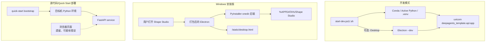

# 开发、部署与发布架构

## 1. 三种运行模式



## 2. 开发启动链路

启动脚本负责解决以下问题：

1. 判断使用激活的 Conda、显式 Active Python 还是项目 `.venv`；
2. 必要时创建环境并安装依赖；
3. 从 `.env` 读取长期配置；
4. 处理端口冲突并写入 `.runtime_startup.env`；
5. 启动 FastAPI；
6. 可选启动 Electron Desktop；
7. 在开发模式下管理 PID 和停止流程。

浏览器打开服务根路径仍可能工作，但它是遗留页面，不能作为当前产品功能验收基准。开发验收应优先使用 Desktop UI。

## 3. 安装版运行边界

安装版不会要求用户准备 Python、Node.js 或 Conda。安装目录包含：

```text
Electron/Chromium runtime
+ desktop application files
+ PyInstaller onedir Python backend
+ static frontend assets
```

运行时可写数据放在用户目录：

```text
%APPDATA%\Shape Studio\
├─ .frontend_runtime_overrides.json
├─ artifacts\runs\
└─ logs\backend.log
```

这样升级安装程序时可以替换程序文件而保留用户配置和历史项目。

## 4. Windows 发布构建链路

```mermaid
flowchart LR
    Version["set-version.ps1<br/>同步版本"] --> Validate["validate-version.ps1<br/>校验 appId/productName/版本"]
    Validate --> Venv["prepare-package-venv.ps1<br/>干净 .venv_package"]
    Venv --> PyInstaller["build-backend.ps1<br/>PyInstaller onedir"]
    PyInstaller --> Backend["dist/backend/raster-svg-api/"]
    Backend --> ElectronBuilder["build-desktop.ps1<br/>electron-builder"]
    ElectronBuilder --> Installer["dist/installers/<br/>NSIS Setup.exe"]
    Installer --> Release["Repository Releases"]
    Release --> Upgrade["用户覆盖安装升级"]
```



发布时需要保持以下应用身份稳定：

```text
appId: com.local.shapestudio
productName: Shape Studio
```

否则操作系统可能把新版本识别为不同应用，破坏覆盖升级和用户数据连续性。

## 5. 平台状态

| 平台 | 当前建议 | 状态 |
| --- | --- | --- |
| Windows | 使用正式安装包 | 已形成安装、覆盖更新、卸载和用户数据保留闭环。 |
| macOS | 仅开发侧构建实验 | 有 DMG 脚本，但签名、公证、架构覆盖和干净机器验证仍不足。 |
| Linux | 源代码/服务方式 | 尚无正式产品安装与升级路径。 |

旧文档中“macOS/Linux 用户打开浏览器 UI”的描述属于过渡方案；由于 Web UI 已缺乏维护，该路径可能遇到界面功能不完整或错误。若未来继续支持这些平台，更合理的方向是完成对应 Electron 安装版，而不是继续扩大旧 Web UI。

## 6. 更新与卸载

### 覆盖更新

- 用户关闭旧版本；
- 下载并运行新安装包；
- 程序目录被替换；
- AppData 中配置、Artifact 和日志默认保留。

### 卸载

- NSIS 提供系统卸载入口；
- 交互卸载时用户可以选择是否删除用户数据；
- 仅删除程序文件时，未来重装可继续读取旧配置和历史结果。

## 7. 运维与故障入口

| 现象 | 首要检查 |
| --- | --- |
| 桌面应用无法打开 | `%APPDATA%\Shape Studio\logs\backend.log` |
| 后端启动超时 | 打包后端是否存在、端口是否可用、`/health` 是否响应 |
| 模型调用失败 | API Key、Base URL、API Format、模型名称与网络 |
| 转换停在 paused | Resume Plan、预算 used/limit/remaining |
| SVG 预览失败 | `review_assets` 中 SVG 和 `render_error.txt` |
| 历史项目无法加载 | Artifact 目录、metadata、run_state 与格式兼容 |

