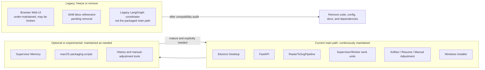
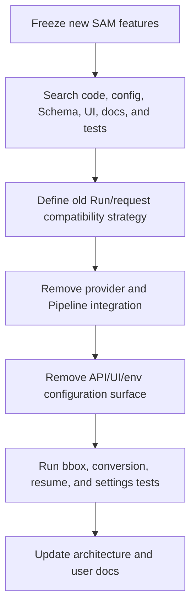
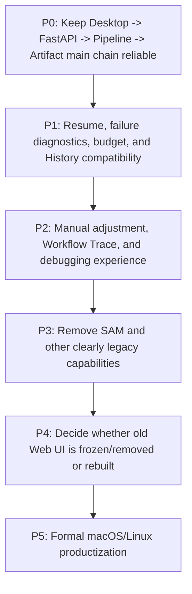

# Maintenance Boundaries, Legacy Capabilities, and Evolution

## 1. Capability Lifecycle



## 2. Core Architectural Value

### Resumability

Long-running, multi-model tasks avoid full reruns through checkpoints, Region caches, and Run State.

### Explainability

Each stage retains prompt-related inputs, structured outputs, raw text, SVG fragments, rendered previews, and reviews.

### Localized Repair

Problems can be narrowed to Object, Region, or Fusion scope, avoiding full-SVG rewrites on every iteration.

### Productization

Electron owns local backend lifecycle, so users do not need to understand Python or Node.js environments.

## 3. Main Complexity and Risks

| Risk | Concrete symptom | Documentation/code governance recommendation |
| --- | --- | --- |
| Multiple entry points create conceptual conflict | README describes Web, Desktop, and CLI as if all were equal | Clearly mark Desktop as the product entry and Web as legacy. |
| Historical configuration keeps expanding | UI, env, runtime override, and request mapping grow in parallel | Maintain field lists and deprecation tables; remove all SAM layers together. |
| Artifact format has implicit coupling | Frontend, resume, and manual adjustment read the same files | Add an explicit Artifact schema/version compatibility strategy. |
| Two-level concurrency is hard to estimate | API Run queue plus Pipeline Region/Object pools | Document concurrency budgets and tune defaults against model-service rate limits. |
| Model-loop cost can escape control | Region/Object/Fusion can all retry | Budget, retry, stagnation, and call logs must be retained together. |
| Legacy code misleads new development | SAM, Web, and old LangGraph code remain in the tree | Mark lifecycle in entry docs and module headers, and plan removal batches. |
| Memory state and disk state diverge | ThreadStore disappears after restart while Artifacts remain | Make disk the resume source of truth and consider rebuilding History indexes on startup. |

## 4. SAM Removal Checklist

SAM bbox refinement is a legacy capability pending removal. Removal should cover:

1. local/remote/provider factory code under `bbox_refinement/`;
2. `WorkflowAgentSuite.object_bbox_refiner`;
3. SAM fields and `resolved_*` helpers in `config.py`;
4. request, result, and Artifact summary fields in `schemas.py`;
5. frontend settings fields, labels, and Runtime Overrides;
6. `.env.example`, README, and settings-mapping documentation;
7. tests for fallback branches;
8. historical Artifact compatibility: old requests containing SAM fields should be ignored or migrated;
9. packaging dependency audit to confirm no heavy residual dependencies remain.



## 5. Legacy Web UI Disposition

The root-path Web page should no longer be described as a product entry equivalent to Desktop. Choose one of two directions explicitly.

### Option A: Formally Freeze and Remove

- Return migration guidance or a health/diagnostic page at the root path.
- Keep `/static/desktop.html` for Electron.
- Remove JS/CSS used only by the old page.
- Update macOS/Linux docs so users are not guided toward the old page.

### Option B: Rebuild a Shared UI

- Let both Browser and Electron load the same maintained page.
- Isolate desktop-only capabilities through host-info and preload capability detection.
- Add automated regression coverage for both hosts.
- Keep the entry marked experimental/unsupported until maintenance is complete.

If there is no explicit cross-platform browser product requirement, Option A has lower maintenance cost.

## 6. Recommended Architecture Governance

### 6.1 Architecture Decision Records

Create `architecture-summary/decisions/` to record:

- why Desktop is the primary entry point;
- why the direct Pipeline replaced the Legacy Coordinator as the main path;
- why Artifact is the resume source of truth;
- why SAM is being removed;
- Artifact version compatibility strategy;
- Region/Object concurrency strategy.

### 6.2 Artifact Schema Version

Add an explicit version to Run Metadata or Run State:

```json
{
  "artifact_schema_version": 1,
  "pipeline_version": "<application-version>"
}
```

Readers should migrate by version or enter read-only mode for unsupported history, instead of inferring historical format only from file presence.

### 6.3 End-to-End Regression Baseline

Keep at least these samples:

- simple single-object image;
- complex multi-Region image;
- text and icon combination;
- parallel Region execution;
- resume after budget exhaustion;
- multi-round Object repair;
- Fusion review failure;
- manual adjustment version creation;
- historical Artifact loading;
- installed-app startup, shutdown, and in-place upgrade.

## 7. Recommended Maintenance Priorities



This order expresses dependencies, not a strict serial schedule. For example, SAM cleanup can start early, but only after confirming it will not break the main Pipeline or old Artifact compatibility.

## 8. Documentation Maintenance Rules

Future architecture changes should update this directory when they:

- add or remove top-level workflow stages;
- add APIs;
- change Artifact files;
- change configuration priority or resolution;
- change product entry points;
- remove SAM or old Web behavior;
- change platform release status.
