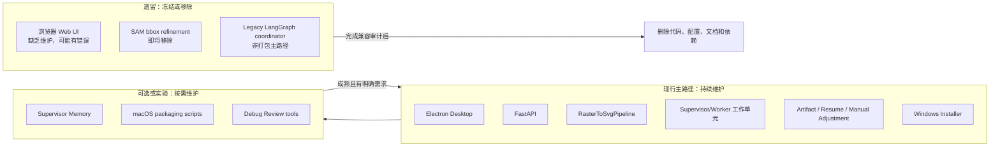
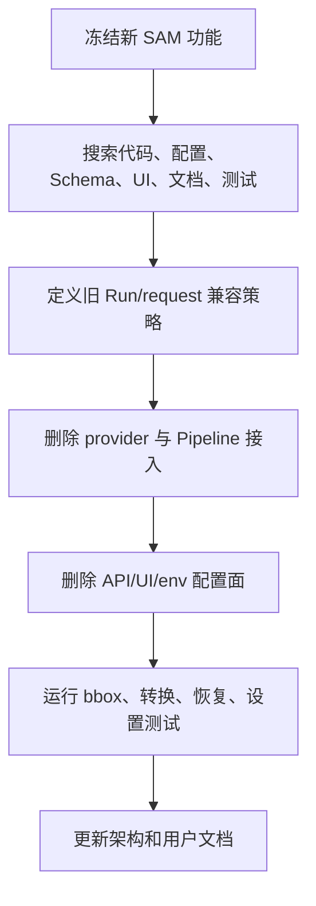
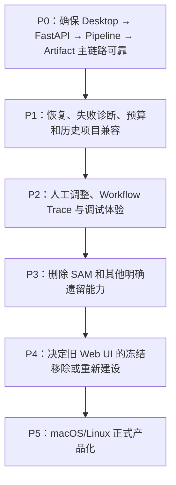

# 维护边界、遗留能力与演进建议

## 1. 能力生命周期图



## 2. 当前架构的核心价值

### 可恢复

长耗时、多模型调用任务通过 checkpoint、Region cache 和 Run State 避免从头重跑。

### 可解释

每个阶段保留 Prompt 相关输入、结构化输出、raw text、SVG fragment、渲染预览和 Review。

### 可局部修复

问题可以被缩小到 Object、Region 或 Fusion 层，避免每次重写整张 SVG。

### 可产品化

Electron 负责本地后端生命周期，用户无需理解 Python 和 Node 环境。

## 3. 主要复杂度与风险

| 风险 | 具体表现 | 文档/代码治理建议 |
| --- | --- | --- |
| 多套入口产生认知冲突 | README 同时描述 Web、Desktop、CLI | 明确 Desktop 为产品主入口，Web 标记为遗留。 |
| 历史配置持续膨胀 | UI、env、runtime override、request 多层映射 | 保持字段清单和弃用表；删除 SAM 时同步所有层。 |
| Artifact 格式隐式耦合 | 前端、恢复、人工调整共同读取文件 | 为 Artifact schema/version 建立显式兼容策略。 |
| 双层并发难以估算 | API Run 线程池 + Pipeline Region/Object 线程池 | 记录并发预算，结合模型服务限流设置默认值。 |
| 模型循环成本不可控 | Region/Object/Fusion 均可能重试 | 预算、重试、停滞和调用日志必须同时保留。 |
| Legacy 代码误导新开发 | SAM、Web、旧 LangGraph 仍在目录中 | 在入口文档和模块头标记生命周期，并制定删除批次。 |
| 内存状态与磁盘状态差异 | ThreadStore 重启后丢失，Artifact 保留 | 明确磁盘是恢复事实源，启动时考虑历史 Run 索引重建。 |

## 4. SAM 移除清单

SAM bbox refinement 已确定为即将移除的遗留能力。移除时应完整覆盖：

1. `bbox_refinement/` 中 local/remote/provider factory；
2. `WorkflowAgentSuite.object_bbox_refiner`；
3. `config.py` 中 SAM 字段和 `resolved_*`；
4. `schemas.py` 中请求、结果和 Artifact Summary 字段；
5. 前端设置字段、标签和 Runtime Overrides；
6. `.env.example`、README 和设置映射文档；
7. 测试与 fallback 分支；
8. 历史 Artifact 读取兼容：旧 request 中多余 SAM 字段应忽略或迁移；
9. 打包依赖审计，确认无残留重量级依赖。



## 5. 遗留 Web UI 处置建议

当前根路径 Web 页面不应继续被描述为与 Desktop 等价的产品入口。建议在两个方案中做明确选择：

### 方案 A：正式冻结并最终移除

- 根路径返回迁移说明或健康/诊断页；
- 保留 `/static/desktop.html` 给 Electron 使用；
- 删除只服务旧页面的 JS/CSS；
- 更新 macOS/Linux 文档，避免引导用户依赖旧页面。

### 方案 B：重新建立共享 UI

- 让 Browser 和 Electron 都加载同一维护页面；
- 将桌面专属能力通过 host-info 和 preload capability detection 隔离；
- 建立两种宿主的自动化回归测试；
- 在恢复维护完成前仍保持“实验/不受支持”标记。

如果没有明确的跨平台浏览器产品需求，方案 A 的维护成本更低。

## 6. 建议增加的架构治理机制

### 6.1 Architecture Decision Records

建议建立 `architecture-summary/decisions/`，记录：

- 为什么 Desktop 是主入口；
- 为什么采用直接 Pipeline 而不是 Legacy Coordinator；
- 为什么 Artifact 是恢复事实源；
- 为什么移除 SAM；
- Artifact 版本兼容策略；
- Region/Object 并发策略。

### 6.2 Artifact Schema Version

建议在 Run Metadata 或 Run State 中增加显式版本：

```json
{
  "artifact_schema_version": 1,
  "pipeline_version": "<application-version>"
}
```

读取旧 Run 时按版本迁移或进入只读模式，避免代码通过“文件是否存在”猜测历史格式。

### 6.3 端到端回归基线

至少保留以下样例：

- 简单单对象图；
- 多 Region 复杂图；
- 含文字/图标组合；
- Region 并行运行；
- 预算耗尽后恢复；
- Object repair 多轮；
- Fusion review 失败；
- 人工调整新版本；
- 历史 Artifact 加载；
- 安装版启动、关闭和覆盖升级。

## 7. 推荐维护优先级



这里的顺序表达依赖关系，不代表所有工作必须完全串行。例如 SAM 清理可以提前开展，但必须先确认不会破坏主 Pipeline 和旧 Artifact 兼容。

## 8. 文档维护规则

后续架构变更应同步检查本目录：

- 新增/删除顶层工作流阶段：更新主流程和 checkpoint 图；
- 新增接口：更新接口表和端到端时序图；
- 改变 Artifact 文件：更新目录树与恢复说明；
- 改变配置优先级：更新配置覆盖图；
- 改变产品入口：更新能力状态矩阵和部署图；
- 移除 SAM 或旧 Web：删除对应遗留节点并记录 Decision；
- 发布平台状态改变：更新平台状态表。

