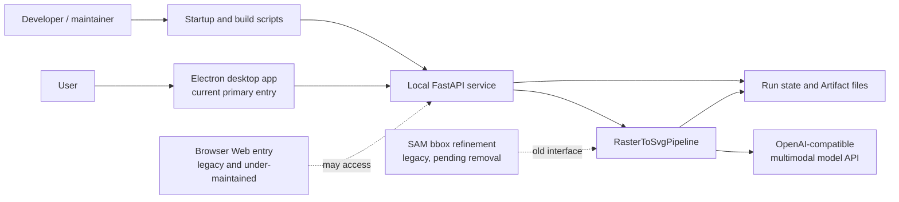

# Shape Studio Current Architecture and Runtime Design

> Baseline date: 2026-07-19  
> Scope: implementation that can be verified in the current repository, not historical plans or earlier designs.  
> Primary product form: Electron desktop application + local FastAPI service + multi-stage raster-to-SVG workflow.

This directory is the authoritative description of architecture and maintenance boundaries. It does not replace operational manuals. For development startup details, see [../docs.development.md](../docs.development.md). For packaging and release details, see [../packaging/README.packaging.md](../packaging/README.packaging.md). For source deployment details, see [../quick-start/README.quick-start.md](../quick-start/README.quick-start.md).

## 1. Reading Guide

| Document | Question answered |
| --- | --- |
| [01-system-architecture.md](./01-system-architecture.md) | Which layers make up the system, and how do they depend on each other? |
| [02-conversion-workflow.md](./02-conversion-workflow.md) | How does one image move through the multi-stage conversion pipeline into SVG? |
| [03-runtime-and-interfaces.md](./03-runtime-and-interfaces.md) | How do the desktop host, API, background tasks, and frontend monitoring cooperate? |
| [04-state-artifacts-and-config.md](./04-state-artifacts-and-config.md) | How are state, resume checkpoints, artifacts, and configuration organized? |
| [05-deployment-and-release.md](./05-deployment-and-release.md) | How do development startup, installed-app startup, and release builds work? |
| [06-maintenance-and-evolution.md](./06-maintenance-and-evolution.md) | What is the main path, what is legacy, and what should be maintained next? |

## 2. One-Sentence Definition

Shape Studio splits a raster image into independently processable visual regions, uses multimodal models for layout understanding, object recognition, SVG generation, review, and repair, then fuses the region results into an editable SVG. The desktop app starts the local backend, provides the user interface, and manages user artifacts.

## 3. Current Capability Status

| Capability | Status | Notes |
| --- | --- | --- |
| Electron desktop app | **Current primary entry point** | Installed builds automatically start the bundled backend and load `/static/desktop.html`. |
| FastAPI backend | **Current core service** | Provides configuration, upload, Thread, Run, History, Artifact, cancellation, resume, and manual-adjustment APIs. |
| Raster-to-SVG workflow | **Current core capability** | Covers layout, bbox checking, region generation, object repair, fusion, and final review. |
| Windows installer | **Current supported release path** | Electron + PyInstaller backend + electron-builder/NSIS. |
| Browser Web app | **Legacy, under-maintained** | `/` can still return `index.html`, but this is no longer the product path and may be incomplete or broken. Do not use it to judge desktop capability. |
| CLI/source execution | **Development and diagnostic entry point** | Useful for development, debugging, and deployment verification, but not the preferred path for ordinary Windows users. |
| SAM bbox refinement | **Legacy, pending removal** | Provider/config surfaces remain in code, but should not be treated as a future architecture dependency or marketed product capability. |
| macOS/Linux installed apps | **Experimental / not yet a formal user path** | Some scripts and build targets exist, but there is no fully supported release loop yet. |
| Legacy LangGraph coordinator | **Optional legacy module** | The direct multimodal conversion pipeline is the installed-build main path; old Agent/LangChain dependencies are not packaged by default. |

## 4. Overall Context

## 5. Key Design Principles

1. **Separate model capability from deterministic control**: models handle visual understanding and SVG content generation; code handles workflow, validation, coordinates, concurrency, budget, retries, persistence, and resume.
2. **Split first, refine second, fuse last**: avoid forcing one model call to reconstruct a complex full image.
3. **Keep intermediates inspectable**: important stages write JSON, SVG fragments, rendered previews, and review results for diagnosis.
4. **Make long runs resumable**: Run State records checkpoints, region status, budget, and failure data so completed stages can be reused.
5. **Let the desktop shell reuse the local service**: Electron does not duplicate conversion logic; it owns process lifecycle, windows, file selection, and productized runtime behavior.
6. **Mark capability lifecycle explicitly**: current, optional, experimental, legacy, and pending-removal items must not be described as equivalent capabilities.

## 6. Code Map

| Concern | Main location |
| --- | --- |
| FastAPI interfaces and background tasks | `src/deepagents_template/api.py` |
| Bounded background execution queues | `src/deepagents_template/bounded_executor.py` |
| Core conversion pipeline | `src/deepagents_template/conversion.py` |
| Workflow nodes | `src/deepagents_template/workflow/` |
| Supervisors and workers | `src/deepagents_template/workflow_orchestration/` |
| Policies and rules | `src/deepagents_template/policy/` |
| Model adapters | `src/deepagents_template/modeling/` |
| State schemas | `src/deepagents_template/schemas.py` |
| Artifact storage and history | `src/deepagents_template/artifacts.py` |
| Artifact mutual-exclusion leases | `src/deepagents_template/artifact_leases.py` |
| Resume logic | `src/deepagents_template/resume.py` |
| Manual adjustment | `src/deepagents_template/manual_adjustment.py` |
| Desktop main process | `desktop/main.js` |
| Desktop page | `src/deepagents_template/static/desktop.html` |
| Desktop frontend logic | `src/deepagents_template/static/js/` |
| Startup scripts | `start-dev.*`, `start-service.*`, `quick-start/` |
| Packaging and release | `packaging/`, `desktop/package.json` |
