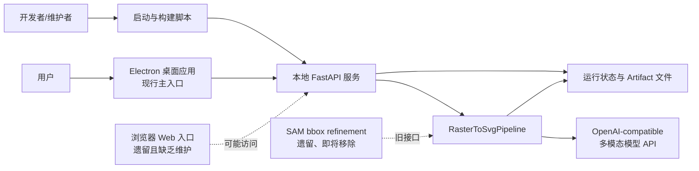

# Shape Studio 现行架构与运行设计总结

> 基线日期：2026-07-16  
> 文档范围：当前代码库中可验证的实现，不以历史设想替代现状。  
> 主要产品形态：Electron 桌面应用 + 本地 FastAPI 服务 + 多阶段图像转 SVG 工作流。

本目录是架构和维护边界的权威说明，不替代操作手册。开发启动细节见 [../docs.development.md](../docs.development.md)，打包发布细节见 [../packaging/README.packaging.md](../packaging/README.packaging.md)，源码部署细节见 [../quick-start/README.quick-start.md](../quick-start/README.quick-start.md)。

## 1. 阅读导航

| 文档 | 回答的问题 |
| --- | --- |
| [01-system-architecture.md](./01-system-architecture.md) | 系统由哪些层组成，各层如何依赖？ |
| [02-conversion-workflow.md](./02-conversion-workflow.md) | 一张图片如何经过多阶段处理成为 SVG？ |
| [03-runtime-and-interfaces.md](./03-runtime-and-interfaces.md) | 桌面端、API、后台任务和前端监控如何协作？ |
| [04-state-artifacts-and-config.md](./04-state-artifacts-and-config.md) | 状态、断点恢复、产物和配置如何组织？ |
| [05-deployment-and-release.md](./05-deployment-and-release.md) | 开发、安装版启动和发布构建如何运行？ |
| [06-maintenance-and-evolution.md](./06-maintenance-and-evolution.md) | 哪些是主路径、遗留内容和后续维护重点？ |

## 2. 一句话定义

Shape Studio 将栅格图片拆分为多个可独立处理的视觉区域，通过多模态模型执行布局理解、对象识别、SVG 生成、检查和修复，再将区域结果融合为可编辑 SVG；桌面应用负责启动本地后端、提供交互界面并管理用户产物。

## 3. 当前能力状态

| 能力 | 状态 | 说明 |
| --- | --- | --- |
| Electron 桌面应用 | **现行主入口** | 安装版自动启动内置后端，加载 `/static/desktop.html`。 |
| FastAPI 后端 | **现行核心服务** | 提供配置、上传、Thread、Run、Artifact、恢复和人工调整接口。 |
| 图片转 SVG 工作流 | **现行核心能力** | 布局、bbox 检查、区域生成、对象修复、融合与最终检查。 |
| Windows 安装包 | **现行支持路径** | Electron + PyInstaller 后端 + electron-builder/NSIS。 |
| 浏览器 Web 应用 | **遗留、缺乏维护** | `/` 仍可返回 `index.html`，但该入口已不是产品主路径，缺乏持续更新，可能出现功能缺失或错误；不能据此判断桌面端能力。 |
| CLI/源代码运行 | **开发与诊断入口** | 适合开发、调试和部署验证，不是普通 Windows 用户的首选。 |
| SAM bbox refinement | **遗留、即将移除** | 代码中仍保留 provider/config 接口，但不应再作为未来架构依赖或产品能力宣传。 |
| macOS/Linux 安装版 | **实验/未形成正式用户路径** | 有部分构建目标和脚本，但尚未形成受支持的产品发布闭环。 |
| Legacy LangGraph coordinator | **可选遗留模块** | 直接多模态转换管线是安装包主路径；旧 Agent/LangChain 依赖不默认进入打包环境。 |

## 4. 总体上下文图

## 5. 最重要的设计原则

1. **模型能力与确定性程序分离**：模型负责视觉理解与 SVG 内容生成；程序负责流程、校验、坐标、并发、预算、重试、持久化和恢复。
2. **先分区、后细化、再融合**：避免让单次模型调用承担整张复杂图片的全部重建。
3. **中间产物可检查**：关键阶段写入 JSON、SVG fragment、渲染预览和 review 结果，便于定位问题。
4. **运行可以恢复**：Run State 记录 checkpoint、区域状态、预算和失败信息，已完成阶段可以复用。
5. **桌面壳复用本地服务**：Electron 不重复实现转换逻辑，只负责进程、窗口、文件选择和产品化运行。
6. **能力状态必须显式标注**：现行、可选、实验、遗留和待移除内容不可混画为同等能力。

## 6. 代码导航

| 关注点 | 主要位置 |
| --- | --- |
| FastAPI 接口与后台任务 | `src/deepagents_template/api.py` |
| 核心转换管线 | `src/deepagents_template/conversion.py` |
| 工作流节点 | `src/deepagents_template/workflow/` |
| Supervisor/Worker | `src/deepagents_template/workflow_orchestration/` |
| 策略与规则 | `src/deepagents_template/policy/` |
| 模型适配 | `src/deepagents_template/modeling/` |
| 状态模型 | `src/deepagents_template/schemas.py` |
| 产物存储 | `src/deepagents_template/artifacts.py` |
| 恢复逻辑 | `src/deepagents_template/resume.py` |
| 人工调整 | `src/deepagents_template/manual_adjustment.py` |
| 桌面主进程 | `desktop/main.js` |
| 桌面页面 | `src/deepagents_template/static/desktop.html` |
| 桌面前端逻辑 | `src/deepagents_template/static/js/` |
| 启动脚本 | `start-dev.*`、`start-service.*`、`quick-start/` |
| 打包发布 | `packaging/`、`desktop/package.json` |
